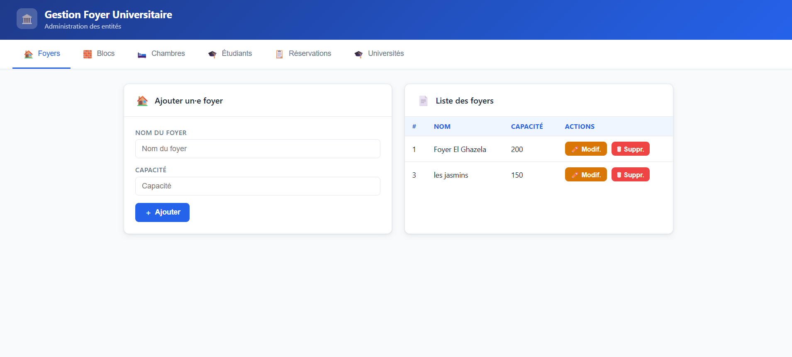

# Gestion de foyers universitaires

Application web de gestion d'hébergement étudiant : foyers, blocs, chambres,
étudiants et réservations. Développée avec Spring Boot et MySQL, avec une
interface web intégrée et des règles métier vérifiées par des tests unitaires.

---

## Aperçu

<!-- Remplacer par une capture de l'interface -->


---

## Fonctionnalités

- **CRUD complet** sur les 6 entités : créer, consulter, modifier, supprimer
- **API REST** — 24 endpoints, 4 par entité
- **Interface web intégrée** — navigation par onglets, formulaires adaptés à
  chaque entité, listes déroulantes alimentées dynamiquement pour les relations
- **Règles métier** appliquées côté serveur, pas seulement dans l'interface
- **Gestion des erreurs** centralisée : chaque violation renvoie un statut HTTP
  approprié et un message lisible
- **Tests unitaires** couvrant les règles métier

---

## Règles métier

| Règle | Comportement |
|---|---|
| Capacité d'un bloc | Doit être strictement positive |
| Numéro de chambre | Unique à l'intérieur d'un même bloc |
| Réservation | Une chambre ne peut être réservée deux fois la même année universitaire |
| Capacité d'une chambre | Le nombre de réservations actives ne peut dépasser le type : SIMPLE 1, DOUBLE 2, TRIPLE 3 |

Toute violation lève une `BusinessException`, interceptée par un
`@RestControllerAdvice` qui renvoie un **HTTP 400** accompagné d'un message
explicite, affiché directement dans l'interface.

---

## Stack technique

**Backend**
`Java 17` · `Spring Boot 3.3.4` · `Spring Web` · `Spring Data JPA` ·
`Hibernate 6.5` · `Lombok` · `Maven`

**Base de données**
`MySQL 8.4` — schéma généré automatiquement par Hibernate

**Frontend**
`HTML` · `CSS` · `JavaScript` — sans framework, appels via `fetch()`

**Tests**
`JUnit 5` · `Mockito`

---

## Architecture

```
Navigateur
    │  HTTP · JSON
    ▼
Controller      reçoit la requête, valide le format
    │
    ▼
Service         applique les règles métier
    │
    ▼
Repository      accès aux données (Spring Data JPA)
    │
    ▼
Hibernate       traduction objet → SQL
    │
    ▼
MySQL
```

Architecture en couches : chaque couche ne communique qu'avec sa voisine
immédiate. Les services sont accessibles par interface, ce qui permet de les
simuler dans les tests.

---

## Modèle de données

```
Universite ──1:1── Foyer
                     │
                    1:N
                     │
                   Bloc
                     │
                    1:N
                     │
                  Chambre ──1:N── Reservation ──N:M── Etudiant
```

Les relations bidirectionnelles portent `@JsonIgnore` du côté de la
collection, afin d'éviter les cycles infinis lors de la sérialisation JSON.

---

## API REST

Le même schéma s'applique aux 6 entités : `foyer`, `bloc`, `chambre`,
`etudiant`, `reservation`, `universite`.

| Méthode | Route | Rôle |
|---|---|---|
| `GET` | `/{entite}/all` | Liste complète |
| `POST` | `/{entite}/add` | Création |
| `PUT` | `/{entite}/update` | Modification |
| `DELETE` | `/{entite}/delete/{id}` | Suppression |

Exemple :

```bash
curl http://localhost:8083/chambre/all

curl -X POST http://localhost:8083/chambre/add \
  -H "Content-Type: application/json" \
  -d '{"numeroChambre":101,"typeC":"SIMPLE","bloc":{"idBloc":1}}'
```

---

## Tests

```bash
./mvnw test
```

9 tests unitaires vérifient les règles métier, sans base de données ni serveur :
les repositories sont simulés avec Mockito.

```
BlocServiceTest           capacité nulle, capacité négative, cas valide
ChambreServiceTest        numéro déjà pris, numéro libre, même numéro autre bloc
ReservationServiceTest    doublon d'année, dépassement de capacité, cas valide
```

---

## Installation

### Prérequis

```
Java 17
MySQL 8
```

### Étapes

```bash
git clone https://github.com/idrissjemli/gestion-foyer-universitaire.git
cd gestion-foyer-universitaire
```

Définir le mot de passe MySQL en variable d'environnement :

```powershell
$env:MYSQL_PASSWORD = "votre_mot_de_passe"
```

```bash
./mvnw spring-boot:run
```

La base `springDoss` et ses tables sont créées automatiquement au premier
démarrage. Aucun script SQL à exécuter.

Ouvrir ensuite **http://localhost:8083**

### Configuration

`src/main/resources/application.properties` ne contient aucun identifiant en
clair. Le mot de passe est lu depuis la variable d'environnement
`MYSQL_PASSWORD`.

---

## Reprise et corrections

Ce projet a été initialement réalisé dans le cadre du cursus ESPRIT, puis
repris et complété. L'état d'origine ne démarrait pas. Correctifs apportés :

| Problème | Correction |
|---|---|
| 3 annotations `mappedBy` référençaient des champs inexistants | Noms de champs corrigés, respect de la convention Java |
| `UniversiteService` et `ReservationService` non implémentés — toutes les méthodes retournaient `null` | Repositories injectés, méthodes implémentées |
| `ReservationRepository` étendait `JpaRepository<Etudiant, Long>` | Corrigé vers l'entité `Reservation` |
| Relation `Chambre → Bloc` inversée : une chambre contenait des blocs | Relation remise dans le bon sens |
| Aucun lien entre `Reservation` et `Chambre` — impossible de savoir qui occupe quelle chambre | Relation `@ManyToOne` ajoutée |
| Cycles de sérialisation Jackson provoquant un JSON invalide | `@JsonIgnore` appliqué côté collection |
| `ChambreController` vide, aucune couche web | 6 controllers REST écrits |
| Aucune règle métier, aucun test | 4 règles et 9 tests unitaires ajoutés |

---

## Pistes d'évolution

- Authentification et rôles avec Spring Security
- Pagination et recherche sur les listes
- Tests d'intégration sur les controllers
- Export des réservations

---

## Auteur

**Idriss Jemli** — Ingénieur Data & BI
[LinkedIn](https://www.linkedin.com/in/idriss-jemli-892068218) ·
[GitHub](https://github.com/idrissjemli)
